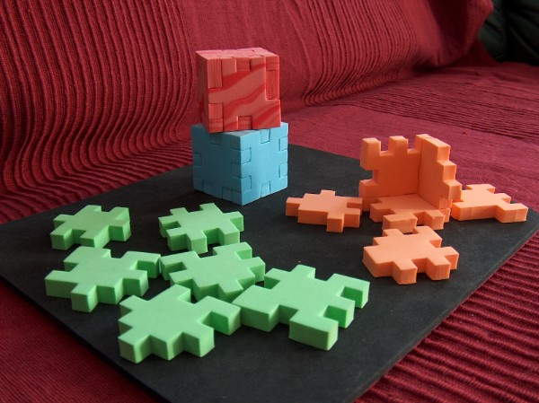
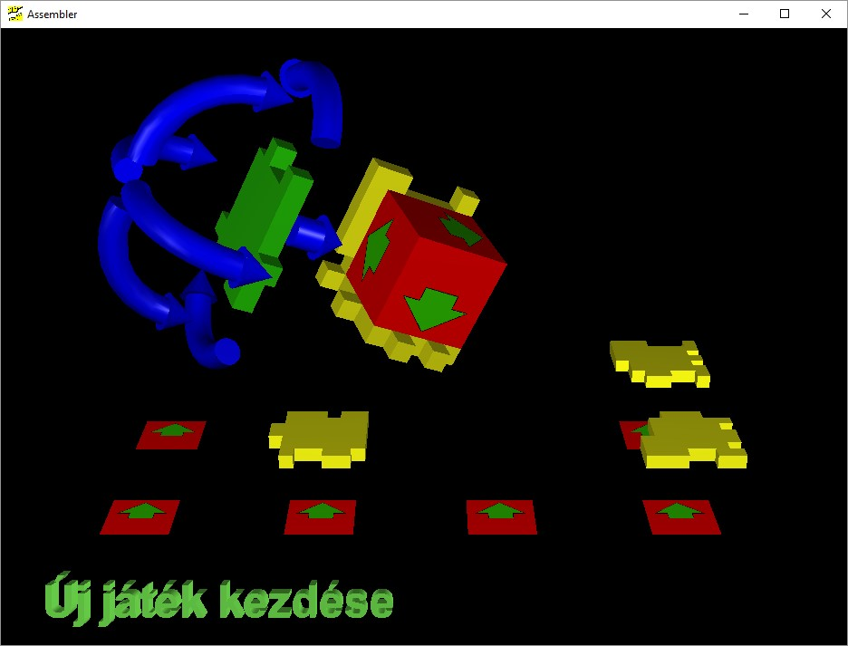

# cube-puzzle
cube assembling puzzle from 2006 written in C++

This project is a computer interpretation of this puzzle:

And looks something like this:

The project is no longer maintained. If you just would like play the game, running test.exe from within Release folder should work on most Windows machines. At the time the project was concieved, internationalization was no concern of mine, but it still shouldn't be complicated to get around in my opinion (though this is not an opinion shared by everyone unanimously :) )